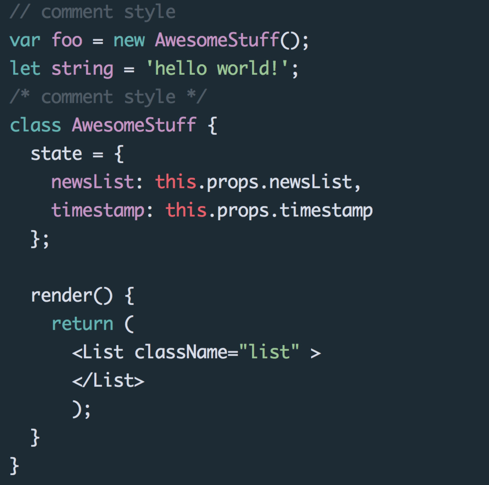

[](https://melpa.org/#/oceanic-theme)

# Oceanic Themes
  Port the theme from [Oceanic Next Color Scheme](https://github.com/voronianski/oceanic-next-color-scheme).

## Install
### Manual
 ```elisp
    ;; clone this repo and add oceanic-theme.el to emacs load-path
    ;; then in your init you can load all of the themes
    ;; without enabling theme (or just load one)
    (load-theme 'oceanic t)
```
### Package.el
Oceanic themes is available in [MELPA](http://melpa.org).

## Screenshot:
  
